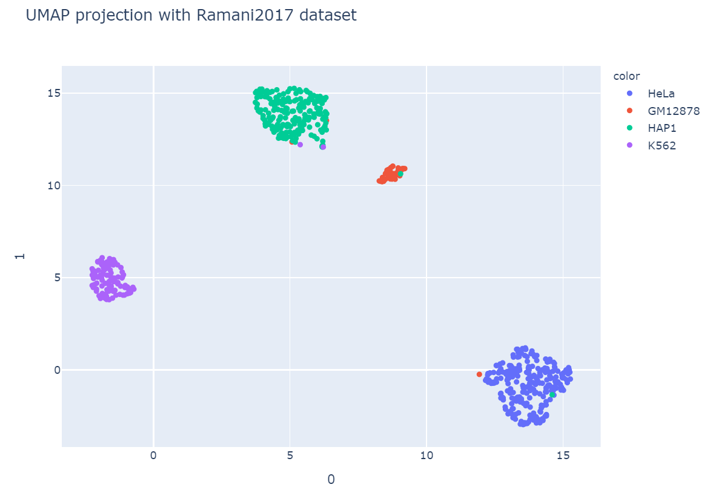

# BubbleCluster
Cluster single cell Hi-C data in a more accuracy manner.

## Background

There has been a rapid increase in the development of single-cell sequencing technology recently, methods of clustering single cell based on transcriptome, methylome and chromatin accessibility have identify lots of different cell types. But unbiased and high accuracy algorithms for clustering single-cell based on chromatin 3D structure are still limited and currently no easy-to-use software packages for this purpose.

Here we present a modified  method based on scHiCluster which have better performance and more biologically meaningful with consideration  of both interchromosomal and intrachromosomal contacts.

## Install

Both R and Python environment is needed for full BubbleCluster analysis. But if you got your own pipeline to generate contact matrix, only python environment is needed.

For R, package  `tidyverse` is needed.

For Python, my bubbleCluster environment is in `./env/bubble.yaml`, you can install it with conda.

## Usage

Before you run bubblecluster, your folder structure should be like:

```
[zliu@mgt interWithintra]$ tree -h
.
├── [ 28K]  pairs
│   ├── [871K]  AACGGTCG_ATCGACGA.HeLa.pairs
│   ├── [409K]  AACGGTCG_CAGTCCAA.HeLa.pairs
……
│   ├── [2.7M]  TTGTGCCG_TGAGGCAA.HAP1.pairs
│   ├── [481K]  TTGTGCCG_TGGCAGTT.HAP1.pairs
│   └── [1.0M]  TTGTGCCG_TTAATCGA.HAP1.pairs
├── [ 129]  runSnake.sh
├── [2.1K]  Snakefile
└── [614K]  vis.ipynb
```


First you should modify Snakefile, this is the pipeline of bubbleCluster,  it generate contact matrix with absolute position and run bubbleCluster with it's default parameters.

Activate your snakemake environment, run:

```shell
conda activate snakemake
chmod +x runSnake.sh
./runSnake.sh
```

And here are what you got:

```
(base) [zliu@mgt interChromosome]$ ls
absPairs  contactMatrix  pairs  pcaMatrix.npy  result.txt  runSnake.sh  Snakefile  umapMatrix.npy  varianceRatio  vis.ipynb
```

Use vis.ipynb to visualize your result.

Here is an example:



bubbleCluster can be used separately with out the snakemake workflow I described above:

run:

```
conda activate bubbleCluster
python {bubbleCluster Path}/bubbleCluster.py -h
```

```
usage: bubbleCluster.py [-h] [-i CONTACTMATRIXPATH] [-r RES] [-p PAD] [--rp RP] [--prct PRCT] [-d NDIM]
                        [-t NCPUS] [-b BENCHMARK] [-l CHRLENGTHPATH]

BubbleCluster, a software for clustering single cell Hi-C data

optional arguments:
  -h, --help            show this help message and exit
  -i CONTACTMATRIXPATH, --input CONTACTMATRIXPATH
                        input folder path of contactMatrix
  -r RES, --resolution RES
                        resolution for bubbleCluster analysis,default to 1 megabase
  -p PAD, --pad PAD     pad for convolution,default to 1, equal to 1 megabase when you set resolution
                        it's default
  --rp RP               random walk restart probability,default is 0.5
  --prct PRCT           prct of the most significant contacts you use for PCA
  -d NDIM, --ndim NDIM  max dimentions
  -t NCPUS, --threads NCPUS
                        total threads of your machine, notice that bubbleCluster draws all threads you
                        have, manage it with smk
  -b BENCHMARK, --benchmark BENCHMARK
                        Benchmark mode, default to false. This would read cell type name from your
                        pairs file and calc ARI. Input should be either "True" or "False".
  -l CHRLENGTHPATH, --length CHRLENGTHPATH
                        read chromosome length from file
```


## Common Q&A

1. How to select PCs?

By default, BubbleCluster use silhouette score to determine the best PCs select, this is the easy way but may cause "false cluster" results. I run a benchmark with different PCs from Ramani 2017 dataset, inter chromosomal contacts only can achieve best performance but intra chromosomal contacts only can have better performance with the first few PCs. 

Unfortunately, currently there are still few single-cell Hi-C datasets and single cell Hi-C data cannot easily acquired by downsampled from bulk. I hope HIRES project(scRNA-seq combine with Hi-C) in our lab can provide a better dataset to test Bubble Cluster. 

Inspired by Seurat, JackStraw procedure may tell us how to choose. But that's beyond my ability and it is not the focus of my current work. Different PCs select for down stream analysis is encouraged.

2. Error in repeating Tan2018 dataset

Tan2018 dataset has only 34 cell and no significant cluster can be found. This cause error exit. But you can still visualize results by using vis.ipynb and pcaMatrix.

3. Error in impute_cpu

The error message could be like this: 

> A = csr_matrix((D[:,2]))……
>
> IndexError: too many indices for array : array is 1-dimensional, but 2 were indexed.

This is often caused by too few contacts in your contact matrix, I recommend at least 5000 contacts/cell for a good cluster result.

4. How's this new method performed on different dataset?

So far I have tested it on 4 different dataset, for low contacts count dataset like Ramani2017 Flaymer2017, BubbleCluster perform better. But on Tan2018/ Tan 2020 dataset, Tan's CpG method perform better. Considering no one have such low contacts these days…… Bubble Cluster just got behind at birth. (Hope this project can get me pass to get my bachelor degree)